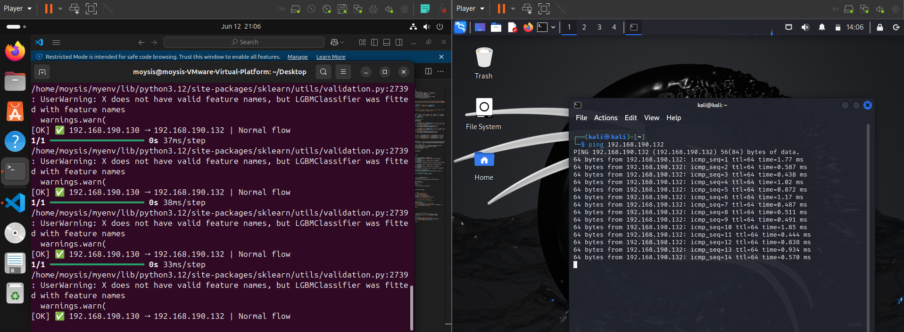
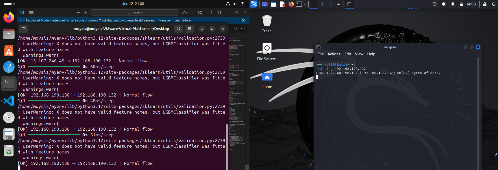
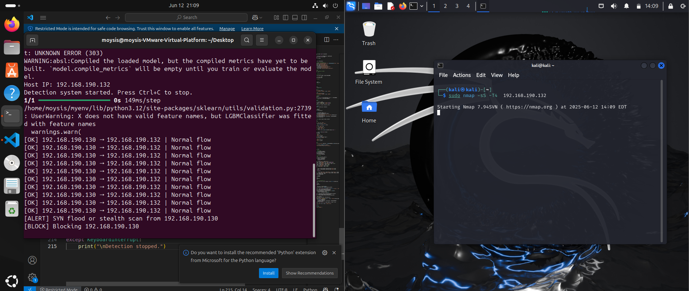
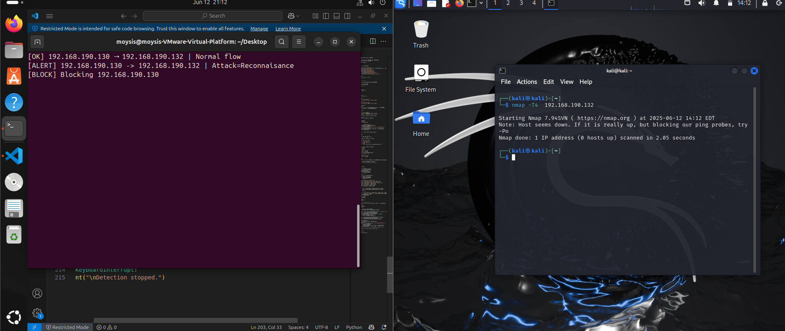

# Real-Time Network Intrusion Detection System (NIDS)

This project implements a real-time, machine learning-based Network Intrusion Detection System (NIDS) using a combination of unsupervised and supervised learning. It is designed to detect anomalous and malicious network traffic in a live environment and respond accordingly by classifying attacks and blocking hostile sources.

---

## Table of Contents

1. [Overview](#1-overview)  
2. [System Architecture](#2-system-architecture)  
3. [Dataset](#3-dataset)  
4. [Installation](#4-installation)  
5. [Usage](#5-usage)  
   - [5.1 Autoencoder Training](#51-autoencoder-training)  
   - [5.2 Classifier Training](#52-classifier-training)  
   - [5.3 Real-Time Detection](#53-real-time-detection)  
6. [Features](#6-features)  
7. [Configuration](#7-configuration)  
8. [Sample Output Visualizations](#8-sample-output-visualizations)  
9. [License and Attribution](#9-license-and-attribution)

---

## 1. Overview

The system provides a modular AI-enhanced intrusion detection pipeline, composed of:

- An autoencoder-based anomaly detector trained on normal traffic
- A LightGBM multiclass classifier trained to identify attack categories
- A real-time monitoring agent (`securityBot.py`) that captures packets, extracts flow features, and applies detection and mitigation logic, including automatic IP blocking

---

## 2. System Architecture

The architecture consists of three major components:

- **Autoencoder**  
  An unsupervised model trained on benign traffic to learn normal behavior. It flags flows as anomalous based on reconstruction error.

- **Classifier**  
  A supervised LightGBM model trained on labeled attack data to predict attack categories (e.g., DoS, Shellcode, Reconnaissance).

- **Security Bot**  
  A real-time packet processing engine using `scapy` that:
  - Sniffs packets from a network interface
  - Aggregates them into flows
  - Applies anomaly detection and attack classification
  - Blocks malicious IPs using `iptables`

---

## 3. Dataset

The project uses the **UNSW-NB15** dataset, which contains labeled normal and attack traffic. Ensure the following CSV files are placed under the directory:

Security AI/CSV Files/Training and Testing Sets/ <br/>
├── UNSW_NB15_training-set.csv <br/>
├── UNSW_NB15_testing-set.csv


---

## 4. Installation

Install Python dependencies:

```bash
pip install -r requirements.txt

pandas
numpy
matplotlib
seaborn
scikit-learn
tensorflow
lightgbm
joblib
scapy
imblearn
```

---

## 5. Usage

### 5.1 Autoencoder Training

To train the autoencoder model on normal traffic data and save the necessary encoders and scalers, run:

python3 autoencoder.py

This script will save the following files:

trained_autoencoder.h5  
trained_scaler.save  
proto_encoder.pkl  
state_encoder.pkl  
important_features.pkl

### 5.2 Classifier Training

To train the LightGBM classifier on labeled attack categories, execute:

python3 classifier.py

This script will save the model and generate performance plots. Saved file:

lightgbm_ids_model_no_smote.joblib

### 5.3 Real-Time Detection

To launch the live detection system that captures traffic and applies anomaly detection and classification:

sudo python3 securityBot.py

The system will log detection results and block malicious IPs using iptables.

Sample output:

[OK] 192.168.1.10 → 192.168.1.1 | Normal flow  
[ALERT] 192.168.1.11 → 192.168.1.1 | Classifier Attack Type: Shellcode  
[BLOCK] Blocking 192.168.1.11

---

## 6. Features

- Real-time packet sniffing using scapy  
- Autoencoder-based anomaly detection  
- Multiclass LightGBM attack classification  
- Automatic IP blocking with iptables  
- SYN flood and stealth scan detection  
- Flow expiration and cleanup  

---

## 7. Configuration

Key parameters for tuning the detection system can be found in `securityBot.py`:

INTERFACE = "ens33"             # Network interface for sniffing  
BLOCK_DURATION = 100            # Seconds to keep an IP blocked  
SYN_FLOOD_THRESHOLD = 20        # SYN packets threshold  
SYN_WINDOW = 1.0                # Time window in seconds  

---

## 8. Sample Output Visualizations






---

## 9. License and Attribution

This project is provided for academic and research use only.